# Car Price Prediction using Machine Learning


This dataset contains information about used cars.
This data can be used for a lot of purposes such as price prediction to exemplify the use of linear regression in Machine Learning.
The columns in the given dataset are as follows:

name
year
selling_price
km_driven
fuel
seller_type
transmission
Owner
## Reading our Data into a Pandas Dataframe
- Read our data into a pandas dataframe, with `.read_csv`
- Print out the head of our dataframe with `.head()`
- Observe the shape of our dataframe with `.shape`
```python
pip install pandas 
import pandas as pd

df = pd.read_csv('env/Code/cardata.csv')
print("First Five Instances of our Dataframe:")
print(df.head())
print("Shape of Our Dataframe:")
print(df.shape)
```


## Observing our Dataframe
As we can see from the output of df.shape and df.head()
we have 301 rows of data and 9 features denoted by (301, 9)
Our 9 features include:
- Car_Name
- Year
- Selling_Price
- Present_Price
- Kms_Driven
- Fuel_Type
- Seller_Type
- Transmission
- Owner

We can also observe that one feature is our output feature or `Dependent Feature` which in this case is `Selling Price`, this feature is dependent on the other independent features such as Kms_Driven, Fuel_Type etc, this feature 'Selling Price' is also the feature we are trying to predict or find.

### Categorical Features

`Categorical data` is non-numeric and often can be characterized into categories or groups. A simple example is color; red, blue, and yellow are all distinct colors.
We encode categorical data numerically because math is generally done using numbers. 

A big part of natural language processing is converting text to numbers. Just like that, our algorithms cannot run and process data if that data is not numerical. Therefore, data scientists need to have tools at their disposal to transform colors like red, yellow, and blue into numbers like 1, 2, and 3 for all the backend math to take place. 

### One Hot Encoding

`One-hot encoding` is a method of identifying whether a unique categorical value from a categorical feature is present or not. What I mean by this is that if our feature is primary color (and each row has only one primary color), one-hot encoding would represent whether the color present in each row is red, blue, or yellow. 

This is accomplished by adding a new column for each possible color. With these three columns representing color in place for every row of the data, we go through each row and assign the value 1 to the column representing the color present in our current row and fill in the other color columns of that row with a 0 to represent their absence

### Our Categorical Features

```python
print(df['Seller_Type'].unique())
print(df['Fuel_Type'].unique())
print(df['Transmission'].unique())
print(df['Owner'].unique())
```

### Checking to see if we have any missing or Null values

```python
#As you can see we have no missing or null values
print(df.isnull().sum())
```
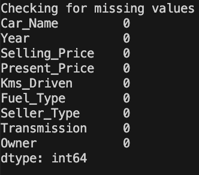

### Creating Final Dataset 

```python
#Notice how we leave out the Car Name for this feature doesn't provide us with any viable data that will be pivotal to training our Machine learning model.
final_dataset = df[['Year','Selling_Price','Present_Price','Kms_Driven','Fuel_Type','Seller_Type','Transmission','Owner']]
print(final_dataset.head())
```
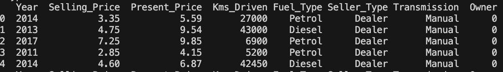

```python
#We add a new column for the current year, we will use this to calculate the age of the car

final_dataset['Current Year'] = 2022
print(final_dataset.head())
```
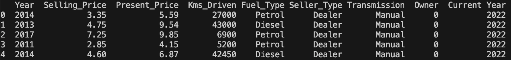

```python
#Calculate the age of the car and store the values in the 'car_age' column

final_dataset['car_age'] = final_dataset['Current Year'] - final_dataset['Year']
print(final_dataset.head())
```
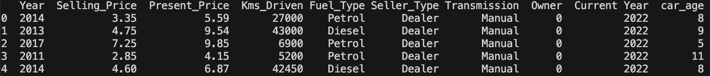

```python
#We then drop the Year columns since we don't need it anymore because we already have the car_age column

final_dataset.drop(['Year'],axis=1,inplace=True)
print(final_dataset.head())
```
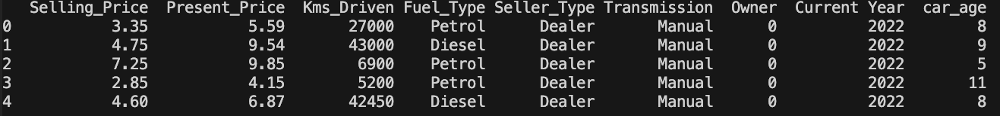

```python
#We then drop the hardcoded Current Year Column 

final_dataset.drop(['Current Year'],axis=1,inplace=True)
print(final_dataset.head())
```
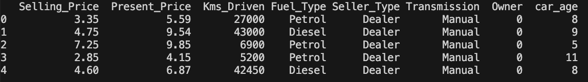


### Applying One Hot Encoding to Categorical Features

`Categorical Features` in our final dataset are Fuel_Type, Transmission and Owner, 

The Fuel_Type Column turns into multiple columns --> Fuel_Type_Diesel, Fuel_Type_Petrol, and CNG, notice how we don't have a column for CNG, the CNG column is denoted by a 0 value in both Fuel_Type_Diesel and Fuel_Type_Petrol


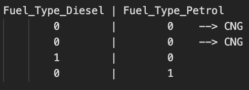


This means that a value of 1 is assigned to that particular row of CNG but we don't need it since we know that if the fuel type isn't petrol or diesel it has to be CNG


```python


final_dataset = pd.get_dummies(final_dataset,drop_first=True)
print(final_dataset.head())

```


### What is a Dummy Variable Trap?

In linear regression models, to create a model that can infer relationships between features (having categorical data) and the outcome, we use the dummy variable technique.

A `“Dummy Variable”` or `“Indicator Variable”` is an artificial variable created to represent an attribute with two or more distinct categories/levels.

The `dummy variable trap` is a scenario in which the independent variables become multi-collinear after addition of dummy variables.

`Multi-collinearity` is a phenomenon in which two or more variables are highly correlated. In simple words, it means value of one variable can be predicted from the values of other variable(s).

This breaks the assumption of linear regression that observations should be independent of each other and this is what we called a dummy variable trap. By adding all the dummy variables in data, we have compromised the accuracy of the regression model.

To avoid `dummy variable trap` we should always add one less (n-1) dummy variable then the total number of categories present in the categorical data (n) because the nth dummy variable is redundant as it carries no new information.

### Checking for Correlations amongst our features

`What is Correlation?`
The mutual relationship, covariation, or association between two or more variables is called Correlation. It is not concerned with either the changes in x or y individually, but with the measurement of simultaneous variations in both variables.

`Correlation` is a highly applied technique in machine learning during data analysis and data mining. It can extract key problems from a given set of features, which can later cause significant damage during the fitting model.
Data having non-correlated features have many benefits. Such as:
- Learning of Algorithm will be faster
- Interpretability will be high
- Bias will be less

```python

print(final_dataset.corr())
```

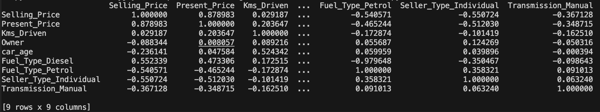

```python
import seaborn as sns
import matplotlib.pyplot as plt

corrmat = final_dataset.corr()
top_corr_features = corrmat.index

plt.figure(figsize=(10,10))

#plot heat map

print(sns.heatmap(final_dataset[top_corr_features].corr(),annot=True,cmap="RdYlGn"))

plt.show()
```
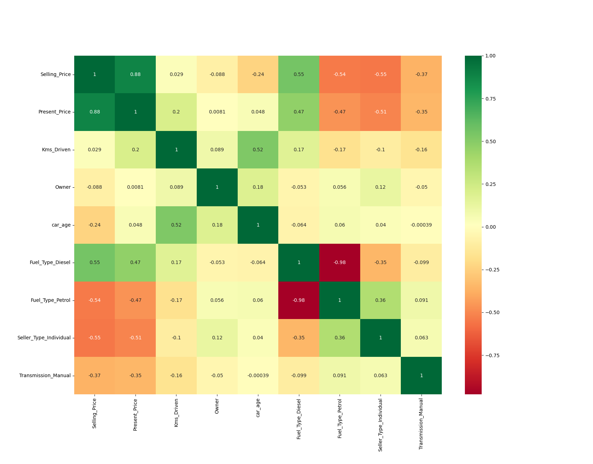

With the help of this heat map we can clearly see some correlations with some features, Fuel_Type_Diesel is negatively correlated with Fuel_Type_Petrol denoted with a dark red color and Selling_Price and Present_Price are positively correlated denoted by a dark green color.

### Independent Vs Dependent Variables

`Dependent Variables` are nothing but the variable which holds the phenomena which we are studying.

`Independent Variables` are the ones which through we are trying to explain the value or effect of the output variable (dependent variable) by creating a relationship between an independent and dependent variable.

`Note` The iloc() function in python is one of the functions defined in the Pandas module that helps us to select a specific row or column from the data set. Using the iloc() function in python, we can easily retrieve any particular value from a row or column using index values. The iloc() function in python is one of the functions defined in the Pandas module that helps us to select a specific row or column from the data set. Using the iloc() function in python, we can easily retrieve any particular value from a row or column using index values.

### Determining Feature Importance

```python
# Selling Price is the dependent Feature everything else is an Independent Feature

X = final_dataset.iloc[:,1:]
y = final_dataset.iloc[:,0]

print("Our Independent Features:")
print(X.head())

print("Our Dependent Feature:")
print(y.head())

#plot graph of feature importances for better visualization
feat_importances = pd.Series(model.feature_importances_, index=X.columns)
feat_importances.nlargest(5).plot(kind='barh')
plt.show() 

```

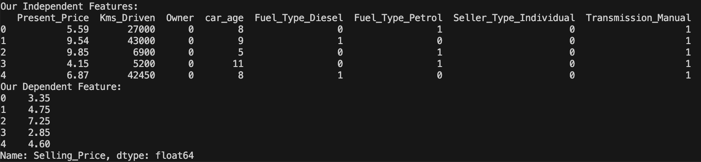 

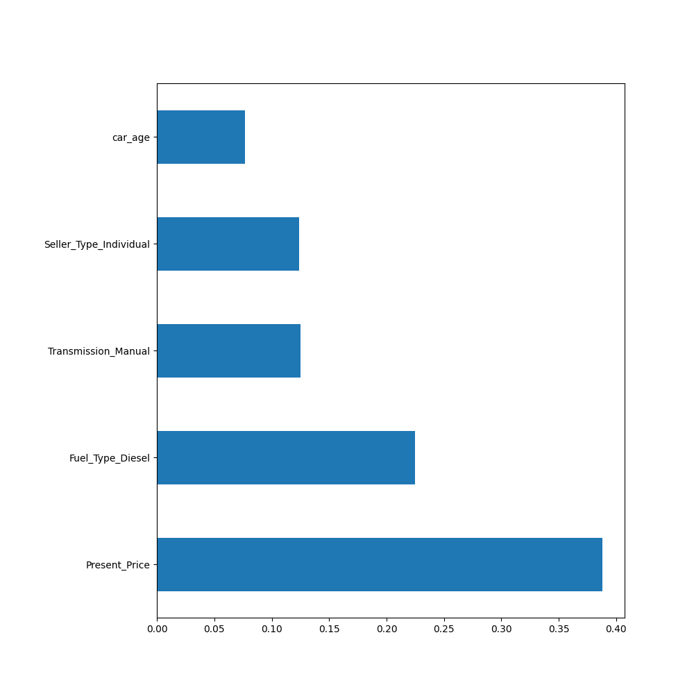 

### Ensemble learning

`Ensemble Learning` is the process of using multiple models, trained over the same data, averaging the results of each model ultimately finding a more powerful predictive/classification result. Our hope, and the requirement, for ensemble learning is that the errors of each model (in this case decision tree) are independent and different from tree to tree.


### Decision Trees

`Decision Trees (DTs)` are a non-parametric supervised learning method used for classification and regression. The goal is to create a model that predicts the value of a target variable by learning simple decision rules inferred from the data features. A tree can be seen as a piecewise constant approximation.


Some `Advantages` of decision trees are:

- Simple to understand and to interpret. Trees can be visualized.
- Requires little data preparation. Other techniques often require data normalization, dummy variables need to be created and blank values to be removed. Note however that this module does not support missing values.
- The cost of using the tree (i.e., predicting data) is logarithmic in the number of data points used to train the tree.
- Able to handle both numerical and categorical data. However, the scikit-learn implementation does not support categorical variables for now. Other techniques are usually specialized in analyzing datasets that have only one type of variable. See algorithms for more information.

The `Disadvantages` of decision trees include:

- Decision-tree learners can create over-complex trees that do not generalize the data well. This is called overfitting. Mechanisms such as pruning, setting the minimum number of samples required at a leaf node or setting the maximum depth of the tree are necessary to avoid this problem.
- Decision trees can be unstable because small variations in the data might result in a completely different tree being generated. This problem is mitigated by using decision trees within an ensemble.

##############################################################

### An extremely randomized tree regressor.

`Extra Trees` is an ensemble machine learning algorithm that combines the predictions from many decision trees.

It is related to the widely used random forest algorithm. It can often achieve as-good or better performance than the random forest algorithm, although it uses a simpler algorithm to construct the decision trees used as members of the ensemble.

It is also easy to use given that it has few key hyper-parameters and sensible heuristics for configuring these hyper-parameters.

The Extra Trees algorithm works by creating a large number of unpruned decision trees from the training dataset. Predictions are made by averaging the prediction of the decision trees in the case of regression or using majority voting in the case of classification.

- `Regression:` Predictions made by averaging predictions from decision trees.
- `Classification:` Predictions made by majority voting from decision trees.


`What is a Series?`
A Pandas Series is like a column in a table.
It is a one-dimensional array holding data of any type.


```python

model = ExtraTreesRegressor()
model.fit(X,y)
print(model.feature_importances_)

#plot graph of feature importances for better visualization
feat_importances = pd.Series(model.feature_importances_, index=X.columns)
feat_importances.nlargest(5).plot(kind='barh')
plt.show() 

```
### Bootstrapping

`Bootstrapping` is the process of randomly sampling subsets of a dataset over a given number of iterations and a given number of variables. These results are then averaged together to obtain a more powerful result. Bootstrapping is an example of an applied ensemble model.

The bootstrapping `Random Forest` algorithm combines ensemble learning methods with the decision tree framework to create multiple randomly drawn decision trees from the data, averaging the results to output a new result that often leads to strong predictions/classifications.


### Random Forest Regression Model

We will use the sklearn module for training our random forest regression model, specifically the `RandomForestRegressor` function. The RandomForestRegressor documentation shows many different parameters we can select for our model. Some of the important parameters are highlighted below:

- `n_estimators` — the number of decision trees you will be running in the model

- `criterion` — this variable allows you to select the criterion (loss function) used to determine model outcomes. We can select from loss functions such as mean squared error (MSE) and mean absolute error (MAE). The default value is MSE.

- `max_depth` — this sets the maximum possible depth of each tree

- `max_features` — the maximum number of features the model will consider when determining a split

- `bootstrap` — the default value for this is True, meaning the model follows bootstrapping principles (defined earlier)

- `max_samples` — This parameter assumes bootstrapping is set to True, if not, this parameter doesn’t apply. In the case of True, this value sets the largest size of each sample for each tree.

Other important parameters are `min_samples_split`, `min_samples_leaf`, `n_job's`, and others that can be read in the sklearn’s RandomForestRegressor documentation.


### Mean Squared Error

`Mean Squared Error` (MSE) is the average of the summation of the squared difference between the actual output value and the predicted output value. Our goal is to reduce the MSE as much as possible.

For example, if we have an actual output array of (3,5,7,9) and a predicted output of (4,5,7,7), then we could calculate the mean squared error as:
((3-4)² + (5–5)² + (7–7)² +(9–7)²)/4 = (1+0+0+4)/4 = 5/4 = 1.25

The root mean squared error (RMSE) is just simply the square root of the MSE, so the in this case the RMSE = 1.25^.5 = 1.12.

### Hyper-Parameter Tuning

So we’ve built a random forest model to solve our machine learning problem but we’re not too impressed by the results. 

`What are our options?` 
Our first step should be to gather more data and perform `feature engineering`. Gathering more data and feature engineering usually has the greatest payoff in terms of time invested versus improved performance, but when we have exhausted all data sources, it’s time to move on to model `hyper-parameter tuning`.

The best way to think about hyper-parameters is like the settings of an algorithm that can be `adjusted` to optimize performance.

While model parameters are learned during training — such as the slope and intercept in a linear regression — `hyper-parameters` must be set by the data scientist before training. 

In the case of a random forest, hyper-parameters include the `number of decision trees in the forest` and the `number of features considered by each tree when splitting a node`. (The parameters of a random forest are the variables and thresholds used to split each node learned during training).

The best hyper-parameters are usually impossible to determine ahead of time, and tuning a model is where machine learning turns from a science into trial-and-error based engineering.

Scikit-Learn implements a set of sensible default hyper-parameters for all models, but these are not guaranteed to be optimal for a problem.

### Over-Fitting

Hyper-parameter tuning relies more on experimental results than theory, and thus the best method to determine the optimal settings is to try many different combinations evaluate the performance of each model. However, evaluating each model only on the training set can lead to one of the most fundamental problems in machine learning: `overfitting`.

If we optimize the model for the training data, then our model will score very well on the `training set`, but will not be able to generalize to new data, such as in a `test set`. 

When a model performs highly on the `training set` but poorly on the `test set`, this is known as over-fitting, or essentially creating a model that knows the training set very well but cannot be applied to new problems. It’s like a student who has memorized the simple problems in the textbook but has no idea how to apply concepts in the messy real world.

### Cross Validation

An overfit model may look impressive on the training set, but will be useless in a real application. Therefore, the standard procedure for hyper-parameter optimization accounts for overfitting through `cross validation`.

The technique of cross validation (CV) is best explained by example using the most common method, `K-Fold CV`. 

When we approach a machine learning problem, we make sure to split our data into a training and a testing set. In K-Fold CV, we further split our training set into `K number of subsets`, called folds. We then iteratively fit the model K times, each time training the data on K-1 of the folds and evaluating on the Kth fold (called the validation data). 

As an example, consider fitting a model with K = 5. The first iteration we train on the first four folds and evaluate on the fifth. The second time we train on the first, second, third, and fifth fold and evaluate on the fourth. 
We repeat this procedure 3 more times, each time evaluating on a different fold. At the very end of training, we `average the performance on each of the folds` to come up with final validation metrics for the model.

### Random Hyper-parameter Grid

To use RandomizedSearchCV, we first need to create a parameter grid to sample from during fitting:

```python
# Number of trees in random forest
n_estimators = [int(x) for x in np.linspace(start = 100, stop = 1200, num = 12)]
# Number of features to consider at every split
max_features = ['auto', 'sqrt']
# Maximum number of levels in tree
max_depth = [int(x) for x in np.linspace(5, 30, num = 6)]
max_depth.append(None)
# Minimum number of samples required to split a node
min_samples_split = [2, 5, 10, 15, 100]
# Minimum number of samples required at each leaf node
min_samples_leaf = [1, 2, 5, 10]
# Method of selecting samples for training each tree
bootstrap = [True, False]
#Create the random grid


random_grid = {'n_estimators': n_estimators,
               'max_features': max_features,
               'max_depth': max_depth,
               'min_samples_split': min_samples_split,
               'min_samples_leaf': min_samples_leaf,
               'bootstrap': [True, False]
               }

pprint(random_grid)

```
On each iteration, the algorithm will choose a different combination of the features. Altogether, there are 2 * 12 * 2 * 3 * 3 * 10 = 4320 settings! However, the benefit of a random search is that we are not trying every combination, but selecting at random to sample a wide range of values.

### Random Search Training
Now, we instantiate the random search and fit it like any Scikit-Learn model:

```python

# Use the random grid to search for best hyperparameters
# First create the base model to tune
rf = RandomForestRegressor()

# Random search of parameters, using 3 fold cross validation, 
# search across 100 different combinations
rf_random = RandomizedSearchCV(estimator = rf, 
param_distributions = random_grid,
scoring='neg_mean_squared_error', 
n_iter = 10, cv = 5, verbose=2, 
random_state=42, n_jobs = 1)

rf_random.fit(X_train,y_train)

```
The most important arguments in `RandomizedSearchCV` are `n_iter`, which controls the number of different combinations to try, and cv which is the number of folds to use for cross validation (we use 10 and 5 respectively). 
More iterations will cover a wider search space and more cv folds reduces the chances of `overfitting`, but raising each will increase the run time. Machine learning is a field of trade-offs, and performance vs time is one of the most fundamental.

We can view the best parameters from fitting the random search:

```python

{'bootstrap': False,
 'max_depth': None,
 'max_features': 'auto',
 'min_samples_leaf': 1,
 'min_samples_split': 10,
 'n_estimators': 200
 }

```


From these results, we should be able to narrow the range of values for each hyperparameter.

# REVISION NEEDS TO BE MADE OPEN TICKET

### Training 

One thing to consider when running random forest models on a large dataset is the potentially long training time. 