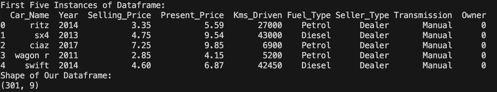

# Car Price Prediction using Machine Learning


This dataset contains information about used cars.
This data can be used for a lot of purposes such as price prediction to exemplify the use of linear regression in Machine Learning.
The columns in the given dataset are as follows:

name
year
selling_price
km_driven
fuel
seller_type
transmission
Owner
## Reading our Data into a Pandas Dataframe
- Read our data into a pandas dataframe, with `.read_csv`
- Print out the head of our dataframe with `.head()`
- Observe the shape of our dataframe with `.shape`
```python
pip install pandas 
import pandas as pd

df = pd.read_csv('env/Code/cardata.csv')
print("First Five Instances of our Dataframe:")
print(df.head())
print("Shape of Our Dataframe:")
print(df.shape)
```


## Observing our Dataframe
As we can see from the output of df.shape and df.head()
we have 301 rows of data and 9 features denoted by (301, 9)
Our 9 features include:
- Car_Name
- Year
- Selling_Price
- Present_Price
- Kms_Driven
- Fuel_Type
- Seller_Type
- Transmission
- Owner

We can also observe that one feature is our output feature or `Dependent Feature` which in this case is `Selling Price`, this feature is dependent on the other independent features such as Kms_Driven, Fuel_Type etc, this feature 'Selling Price' is also the feature we are trying to predict or find.

### Categorical Features

Categorical data is non-numeric and often can be characterized into categories or groups. A simple example is color; red, blue, and yellow are all distinct colors.
We encode categorical data numerically because math is generally done using numbers. 

A big part of natural language processing is converting text to numbers. Just like that, our algorithms cannot run and process data if that data is not numerical. Therefore, data scientists need to have tools at their disposal to transform colors like red, yellow, and blue into numbers like 1, 2, and 3 for all the backend math to take place. 

### One Hot Encoding

One-hot encoding is a method of identifying whether a unique categorical value from a categorical feature is present or not. What I mean by this is that if our feature is primary color (and each row has only one primary color), one-hot encoding would represent whether the color present in each row is red, blue, or yellow. 

This is accomplished by adding a new column for each possible color. With these three columns representing color in place for every row of the data, we go through each row and assign the value 1 to the column representing the color present in our current row and fill in the other color columns of that row with a 0 to represent their absence

### Our Categorical Features

```python
print(df['Seller_Type'].unique())
print(df['Fuel_Type'].unique())
print(df['Transmission'].unique())
print(df['Owner'].unique())
```

### Checking to see if we have any missing or Null values

```python
#As you can see we have no missing or null values
print(df.isnull().sum())
```


### Creating Final Dataset 

```python
#Notice how we leave out the Car Name for this feature doesn't provide us with any viable data that will be pivotal to training our Machine learning model.
final_dataset = df[['Year','Selling_Price','Present_Price','Kms_Driven','Fuel_Type','Seller_Type','Transmission','Owner']]
print(final_dataset.head())
```


```python
#We add a new column for the current year, we will use this to calculate the age of the car

final_dataset['Current Year'] = 2022
print(final_dataset.head())
```


```python
#Calculate the age of the car and store the values in the 'car_age' column

final_dataset['car_age'] = final_dataset['Current Year'] - final_dataset['Year']
print(final_dataset.head())
```


```python
#We then drop the Year columns since we don't need it anymore because we already have the car_age column

final_dataset.drop(['Year'],axis=1,inplace=True)
print(final_dataset.head())
```


```python
#We then drop the hardcoded Current Year Column 

final_dataset.drop(['Current Year'],axis=1,inplace=True)
print(final_dataset.head())
```


### Applying One Hot Encoding to Categorical Features

Categorical Features in our final dataset are Fuel_Type, Transmission and Owner, 

The Fuel_Type Column turns into multiple columns --> Fuel_Type_Diesel, Fuel_Type_Petrol, and CNG, notice how we don't have a column for CNG, the CNG column is denoted by a 0 value in both Fuel_Type_Diesel and Fuel_Type_Petrol


This means that a value of 1 is assigned to that particular row of CNG but we don't need it since we know that if the fuel type isn't petrol or diesel it has to be CNG


```python


final_dataset = pd.get_dummies(final_dataset,drop_first=True)
print(final_dataset.head())

```


### What is a Dummy Variable Trap?

In linear regression models, to create a model that can infer relationships between features (having categorical data) and the outcome, we use the dummy variable technique.

A “Dummy Variable” or “Indicator Variable” is an artificial variable created to represent an attribute with two or more distinct categories/levels.

The dummy variable trap is a scenario in which the independent variables become multi-collinear after addition of dummy variables.

Multi-collinearity is a phenomenon in which two or more variables are highly correlated. In simple words, it means value of one variable can be predicted from the values of other variable(s).

This breaks the assumption of linear regression that observations should be independent of each other and this is what we called a dummy variable trap. By adding all the dummy variables in data, we have compromised the accuracy of the regression model.

To avoid dummy variable trap we should always add one less (n-1) dummy variable then the total number of categories present in the categorical data (n) because the nth dummy variable is redundant as it carries no new information.

### Checking for Correlations amongst our features

`What is Correlation?`
The mutual relationship, covariation, or association between two or more variables is called Correlation. It is not concerned with either the changes in x or y individually, but with the measurement of simultaneous variations in both variables.

Correlation is a highly applied technique in machine learning during data analysis and data mining. It can extract key problems from a given set of features, which can later cause significant damage during the fitting model.
Data having non-correlated features have many benefits. Such as:
- Learning of Algorithm will be faster
- Interpretability will be high
- Bias will be less

```python

print(final_dataset.corr())
```


```python
import seaborn as sns
import matplotlib.pyplot as plt

corrmat = final_dataset.corr()
top_corr_features = corrmat.index

plt.figure(figsize=(10,10))

#plot heat map

print(sns.heatmap(final_dataset[top_corr_features].corr(),annot=True,cmap="RdYlGn"))

plt.show()
```


With the help of this heat map we can clearly see some correlations with some features, Fuel_Type_Diesel is negatively correlated with Fuel_Type_Petrol denoted with a dark red color and Selling_Price and Present_Price are positively correlated denoted by a dark green color.

### Independent Vs Dependent Variables

Dependent variables are nothing but the variable which holds the phenomena which we are studying.

Independent variables are the ones which through we are trying to explain the value or effect of the output variable (dependent variable) by creating a relationship between an independent and dependent variable.

`Note` The iloc() function in python is one of the functions defined in the Pandas module that helps us to select a specific row or column from the data set. Using the iloc() function in python, we can easily retrieve any particular value from a row or column using index values. The iloc() function in python is one of the functions defined in the Pandas module that helps us to select a specific row or column from the data set. Using the iloc() function in python, we can easily retrieve any particular value from a row or column using index values.

### Determining Feature Importance

```python
# Selling Price is the dependent Feature everything else is an Independent Feature

X = final_dataset.iloc[:,1:]
y = final_dataset.iloc[:,0]

print("Our Independent Features:")
print(X.head())

print("Our Dependent Feature:")
print(y.head())
```

 

 

### Decision Trees

Decision Trees (DTs) are a non-parametric supervised learning method used for classification and regression. The goal is to create a model that predicts the value of a target variable by learning simple decision rules inferred from the data features. A tree can be seen as a piecewise constant approximation.


Some advantages of decision trees are:

- Simple to understand and to interpret. Trees can be visualized.
- Requires little data preparation. Other techniques often require data normalization, dummy variables need to be created and blank values to be removed. Note however that this module does not support missing values.
- The cost of using the tree (i.e., predicting data) is logarithmic in the number of data points used to train the tree.
- Able to handle both numerical and categorical data. However, the scikit-learn implementation does not support categorical variables for now. Other techniques are usually specialized in analyzing datasets that have only one type of variable. See algorithms for more information.

The disadvantages of decision trees include:

- Decision-tree learners can create over-complex trees that do not generalize the data well. This is called overfitting. Mechanisms such as pruning, setting the minimum number of samples required at a leaf node or setting the maximum depth of the tree are necessary to avoid this problem.
- Decision trees can be unstable because small variations in the data might result in a completely different tree being generated. This problem is mitigated by using decision trees within an ensemble.

##############################################################

`An extremely randomized tree regressor.`

Extra Trees is an ensemble machine learning algorithm that combines the predictions from many decision trees.

It is related to the widely used random forest algorithm. It can often achieve as-good or better performance than the random forest algorithm, although it uses a simpler algorithm to construct the decision trees used as members of the ensemble.

It is also easy to use given that it has few key hyper-parameters and sensible heuristics for configuring these hyper-parameters.

The Extra Trees algorithm works by creating a large number of unpruned decision trees from the training dataset. Predictions are made by averaging the prediction of the decision trees in the case of regression or using majority voting in the case of classification.

- `Regression:` Predictions made by averaging predictions from decision trees.
- `Classification:` Predictions made by majority voting from decision trees.


```python

model = ExtraTreesRegressor()
model.fit(X,y)
print(model.feature_importances_)

#plot graph of feature importances for better visualization
feat_importances = pd.Series(model.feature_importances_, index=X.columns)
feat_importances.nlargest(5).plot(kind='barh')
plt.show() 

```